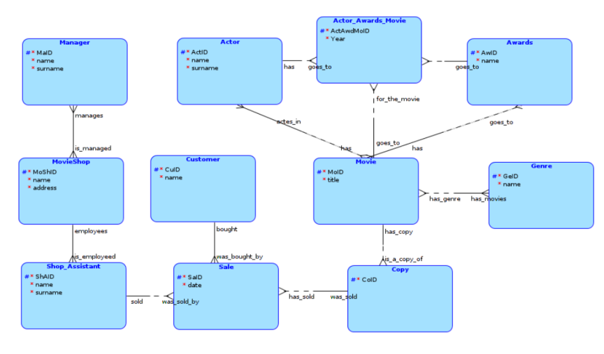
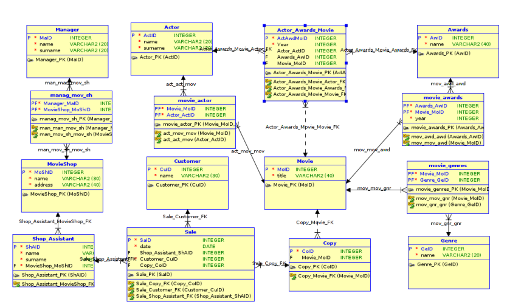

  
</br>
</br>
</br>
</br>

 ##Turcanu Victor
 #####[turcavic@fit.cvut.cz]
 
 # Movie Shop Database
 
## Description

>There is a **movie shop** system. Each shop has one or more **managers**, **shop assistants** and **customers**. In order to perform a better management of movie **loan/shoppings**, there is a database of **movies** (of the products).

>Each **shop** is identified by a movie shop id number (**MAID**). It has its name and address, which are mandatory attributes.

>Each **Manager** is identified by his id number (**MAID**). A manager has a name, a surname - both this attributes are mandatory. The movie shop which is managed by a specific manager is defined by the relationship **Manager_Movieshop**.

>Each **Movie Shop** has one or more **Shop Assistants**. Each Shop Assistant is identified by its id number (**SHAID**). As with Managers, Shop Assistant has 2 attributes: name, surname. 

>There is also a **Customer**, which is identified by his id number (**CUID**). Each customer must have a name and a surname.

>In order to perform a better search of a specific movie, we must have a new entity **Movie**, which must be identified by a unique id number (**MOID**). It must have a name, year of realease, an optional list of awards for the movie and also two mandatory lists of actors which play in it and of the genres of the movie. 

>The list of **actors** will be stored in another entity - **Actor**. Each actor has a name, surname. The list of movies he acted is will be defined by the relationship **Movie_actors**.

>In case of the **awards**, we will have one table which will contain the titles of the awards, but we will have **two relations** for the movie: one will connect also the actors who received the awards, the second one just fo the movie. Both of this relations will have the **year** attribute. For the first relation (actor awards) we will need an intermediate table: **Actor_Awards_Movie**.


>At the end we will store the **sales** which are performed by a specific **shop assistant**, for a specific **customer** and a specific **copy** of a movie. Also the sale entity will hold the date when it was performed.

## Logical Model


 
## Relational Model
 


## Loops

>Here there are 3 loops: 
>	1. **Movie** - **Movie_Actor** - **Actor** - **Actor_Awards_Movie** - **Awards** - **Movie_Awards**
>	2. **Movie** - **Movie_Actor** - **Actor** - **Actor_Awards_Movie**
>	3. **Movie** - **Actor_Awards_Movie** - **Awards** - **Movie_Awards**

>The meaning of these loops is that a movie can obtain an award in two different situations: 
>	1. The general award for the entire movie
>	2. The award which was received by an actor for a specific movie.

## SQL Statements + Realtional Algebra Statements

1. List all release years of all movies.
```
MOVIE[YEAR]
```
```sql
select year 
from movie;
```
2. Select the titles of the movies which were sold.

```
(MOVIE * COPY * SALE)[TITLE]
```
```sql
select distinct title 
from movie mo, copy co, sale s
where mo.MOID=co.moid and s.coid=co.coid;
```
3. Find the name of the shop assistant, the name of the customer and the date when the "Titanic" movie was sold.
```
(CUSTOMER * SALE * SHOP_ASSISTANT * COPY * MOVIE)(MOVIE.title='Titanic')[SHOP_ASSISTANT.NAME, CUST.NAME, DATE1]
```
```sql
select shap.name "Shop assistant", cust.name "Customer", date1
from customer cust, sale s, shop_assistant shap, copy co, movie mo
where cust.cuid=s.cuid and shap.shaid=s.shaid and co.coid=s.coid
	  and mo.moid=co.moid and mo.title='Titanic';
```
4. Find the coid which were not sold.
```
copy[coid] \ sale[coid]
```
```sql
select coid
from copy
minus
select coid
from sale;
```
5. Find the coid which were not sold.
```
copy[coid] \ sale[coid]
```
```sql
select coid 
from copy 
where coid not in ( select coid
					from sale)
order by coid;
```
6. Find the coid which were not sold.
```
copy[coid] \ sale[coid]
```
```sql
select coid 
from copy co
where not exists (select *
				  from sale s
				  where co.coid=s.coid)
order by coid;
```
7. Find all 'Comedy' and 'Action' movies.
```
(MOVIE * ((MOVIE_GENRES * GENRE)(name='Comedy')[moid]  ∩  (MOVIE_GENRES * GENRE)(name='Action')[moid]))[title]
```
```sql
select title
from movie mo
where moid in (select moid
			  from movie_genres mg join genre g using(geid)
			  where g.name='Comedy'
			  intersect
			  select moid
			  from movie_genres mg join genre g using(geid)
			  where g.name='Action');
```
8. Find all 'Comedy' or 'Action' movies.
```
(MOVIE * ((MOVIE_GENRES * GENRE)(name='Comedy')[moid]   ∪   (MOVIE_GENRES * GENRE)(name='Action')[moid]))[title]
```
```sql
select title
from movie mo
where moid in (select moid
			  from movie_genres mg join genre g using(geid)
			  where g.name='Comedy'
			  union
			  select moid
			  from movie_genres mg join genre g using(geid)
			  where g.name='Action');
```
9. How many 'Drama' movies are registred in table "movie".
```sql
select count(title) "Nr movies"
from movie join movie_genres mg using(moid) join genre g on (mg.geid=g.geid)
where g.name='Drama';
```
10. Find the shop assistants (name, surname) who sold more than 3 copies of movies.
```sql
select name, surname
from shop_assistant shas
where 2 < ( select count(*)
			from sale s
			where s.shaid = shas.shaid);
```
11. What is the average release year of the movies?
```sql
select round(avg(year), 0) as "Average release year"
from movie;
```
12. Find the shop assistants (name, surname) who sold more than 3 copies of movies.
```sql
select name, surname
from shop_assistant join sale using(shaid)
group by name, surname
having count(*) >= 3;
```
13. For each genre find the number of movies it has. Include genres without movies.
```sql
select g.GEID, name "Genre", count(mg.geid) "Nr of movies"
from genre g left outer join movie_genres mg on (g.geid=mg.geid) 
			 join movie using (moid)
group by g.GEID, name;
```
14. For each genre find the number of movies it has. Include genres without movies.
```sql
select g.geid, g.name as "Genre",
	(select count(*) 
	 from movie_genres mg 
	 where g.geid = mg.geid) as "Nr of movies"
from genre g;
```
15. List the names of actors and the number of movies they acted in. Order the list descending by the nr. of movies.
```sql
select surname, name, count(distinct mac.MOID) as "Nr of movies"
from actor ac, movie_actor mac, movie mo
where ac.actid=mac.actid and mo.moid=mac.MOID 
group by surname, name
order by "Nr of movies" desc;
```
16. List the names of actors and the number of movies they acted in. Order the list descending by the nr. of movies. Hide actors with only one movie.
```sql
select surname, name, count(distinct mac.MOID) as "Nr of movies"
from actor ac, movie_actor mac, movie mo
where ac.actid=mac.actid and mo.moid=mac.MOID
group by surname, name
order by "Nr of movies" desc;
```
```sql
select name, surname, nr_movies "Nr of movies"
from actor ac, (select count(distinct moid) as nr_movies, actid
				from movie_actor
				group by actid) nr_mact
where ac.ACTID=nr_mact.ACTID 
order by nr_movies desc;
```
17. List the names of actors and the number of movies they acted in if the release year is more recent than 1980. Order the list descending by the nr. of movies.
```sql
select surname, name, count(distinct mac.MOID) as "Nr of movies"
from actor ac, movie_actor mac, movie mo
where ac.actid=mac.actid and mo.moid=mac.MOID and mo.year > 1980
group by surname, name
having count(*) >= 1
order by "Nr of movies" desc;
```
```sql
select name, surname, nr_movies "Nr of movies"
from actor ac, (select count(distinct moid) as nr_movies, ACTID 
				from movie_actor join movie
				using (moid)
				where movie.year > 2000
				group by actid) nr_mact
where ac.ACTID=nr_mact.ACTID 
order by nr_movies desc;
```
18. Create a view "Favourite_movies" (moid, title, year) which were sold more than 2 times.
```sql
create or replace view Favourite_movies as
	select mo.moid, title, year
	from movie mo, (select moid, count(moid) as nr_copies
					from copy co
					where exists (select *
						from sale s
						where s.coid = co.coid)
					group by moid) temp
	where mo.moid=temp.moid and  temp.nr_copies >= 2;
```
19. List the years of the favourite_movies.
```sql
select distinct year
from favourite_movies;
```
20. Cuid and name of the customer who was served by all the shop assistants.
```
((SALE[cuid, shaid]) ÷ (SHOP_ASSISTANT[shaid])) * CUSTOMER
```
```sql
select cu.cuid, cu.name
from customer cu
where not exists (select shas.shaid
				  from shop_assistant shas
				  where not exists (select s.shaid
									from sale s
									where s.shaid = shas.shaid and cu.cuid = s.cuid));
```
21. Genre id and name which doesn't have a movie.
```sql
select g.geid, g.name
from genre g
where g.geid not in (select mog.geid
				  from movie_genres mog);
```
22. Delete movies which were never sold.
```sql
delete movie
where moid not in (select moid
				  from copy co 
				  where co.moid = mo.moid and exists (select 'X'
													  from sale s
													  where s.coid = co.coid));
```
23. Update the year = year + 1 to all movies.
```sql
update movie
set year = year - 1;
```
24. Find the name, address of the movie shop where works the shop assistant who has sold the max. nr. of copies.
```sql
select msh.name, msh.address
from movieshop msh join shop_assistant using(moshid)
where shaid = ( select shaid
				from (select count(coid) as nr_copies, shaid
					  from sale s
					  group by shaid
					  order by nr_copies desc)
					  where rownum = 1);
```
25. List all the actors (name and surname) and the titles of the movies they played in.
```
(ACTOR * MOVIE_ACTOR * MOVIE)[name, surname, title]
```
26. List all the awards of Leo DiCaprio.
```
(ACTOR * ACTOR_AWARDS_MOVIE * AWARDS)(ACTOR.name = 'Leo Dicaprio')[AWARDS.name, year]
```
27. List the names and surnames of all managers.
```
MANAGER[name, surname]
```


## SQL Statements Cover

| Category      | Statment number   | Description of statement category  |
|:-------------:|:-----------------:| :-----|
| A             |1                  | Simple Queries |
| B             |2, 3               | Choose all satisfying a condition |
| C             |4, 5, 6            | Choose all which don't satisfy a condition|
| D             |20                 | General quantifiers (set division) |
| E1            |2, 9, 13           | Join (`JOIN ON`) |
| E2            |7, 8, 9, 12, 24    | Join (`NATURAL JOIN , JOIN USING`) |
| E3            |3, 15, 16, 17, 18  | Join (`CROSS JOIN`) (cartesian product)|
| E4            |13                 | Outer join (`LEFT, RIGHT OUTER JOIN`) |
| F1            |6, 7, 8, 10, 20    | Subquery inside (`WHERE`) |
| F2            |16, 17, 18, 24     | Subquery inside (`FROM`) |
| F3            |14                 | Subquery inside (`SELECT`) |
| F4            |6, 18, 20          | Correlated subqueries (`EXISTS, NOT EXISTS`) |
| G1            |8                  | Set union query (`UNION`) |
| G2            |4                  | Set subtraction query (`EXCEPT`, Oracle - `MINUS` ) |
| G3            |7                  | Set intersection (`INTERSECT`)
| H1            |9, 10, 11, 12, 13  | Aggregation functions (`COUNT`, `SUM`, `MIN`, `MAX`, `AVG`)|
| H2            |17                 | Aggregation with `GROUP BY`/`HAVING` clauses |
| I             |4, 5, 6            | Same query using three different formulations |
| J             |17                 | All select clauses (`SELECT FROM WHERE GROUP BY HAVING ORDER BY`) |
| K             |18                 | View |
| L             |19                 | Query which uses a view |
| M             |23                 | `UPDATE` statement with subquery in `WHERE`/`SET` |
| N             |22                 | `DELETE` statement with subquery in `WHERE`/`SET` |

## Scripts

Database Creation Scripts - [creation scripts]

Database Insert Scripts - [insert scripts]

Database Query Scripts - [query scripts]


 [creation scripts]: sql/CreationScripts.sql
 [insert scripts]: sql/InsertScripts.sql
 [query scripts]: sql/SelectScripts.sql 
 [turcavic@fit.cvut.cz]: turcavic@fit.cvut.cz
